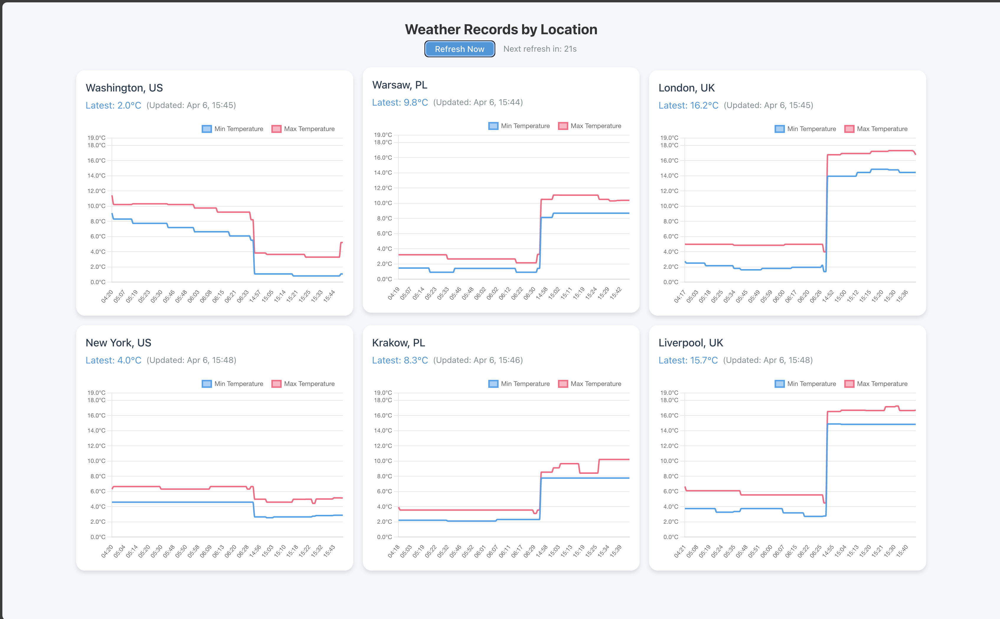

# Weather App

Simple application loading data from Open Weather featuring a React frontend and .NET backend.


## 🚀 Getting Started

### Prerequisites
- Node.js (Latest LTS version)
- .NET 8 SDK
- Docker and Docker Compose
- Azure CLI (for deployment)

### Local Development Setup

1. **Backend Setup**
```bash
cd backend/JJaniszewski.WeatherApp.AzureFunction
# Create local settings
./create_settings.ps1 -weatherApiKey "<your_api_key>"    # Create local.settings.json with your Weather API key

cd ../JJaniszewski.WeatherApp.PublicApi
./create_settings.ps1                     # Create appsettings.Development.json
```

2. **Frontend Setup**
```bash
cd frontend
npm install           # Install dependencies
npm run dev          # Start development server
```




3. **Database Setup**
```bash
cd backend
docker-compose -f db-compose.yml up -d    # Start the database
```

## 🏛️ Architecture

The project follows a clean architecture pattern with the following components:

- **JJaniszewski.WeatherApp.Domain**: Core business logic and entities
- **JJaniszewski.WeatherApp.Application**: Application services and use cases
- **JJaniszewski.WeatherApp.Infrastructure**: External service implementations
- **JJaniszewski.WeatherApp.PublicApi**: API endpoints and controllers
- **JJaniszewski.WeatherApp.AzureFunction**: Serverless functions for loading Weather records
- **JJaniszewski.WeatherApp.DataMigrations**: Database migrations

## 🧪 Testing

The project includes a comprehensive test suite:

```bash
cd backend/tests
dotnet test         # Run backend tests
```